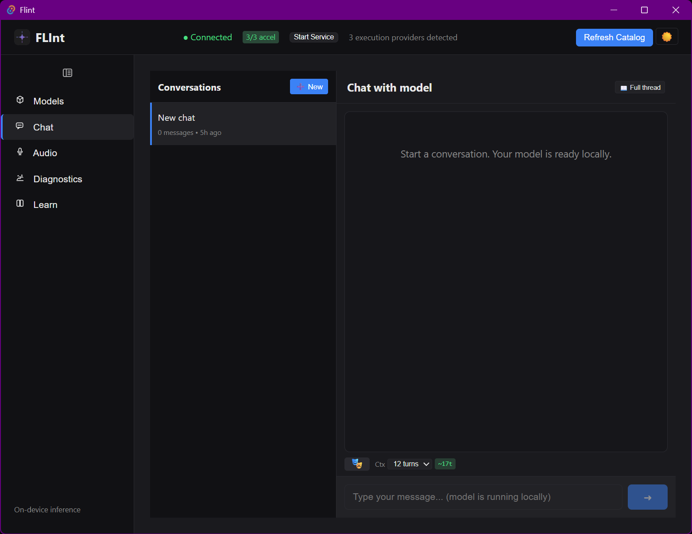
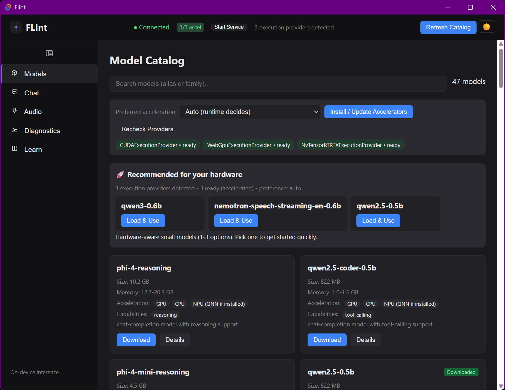
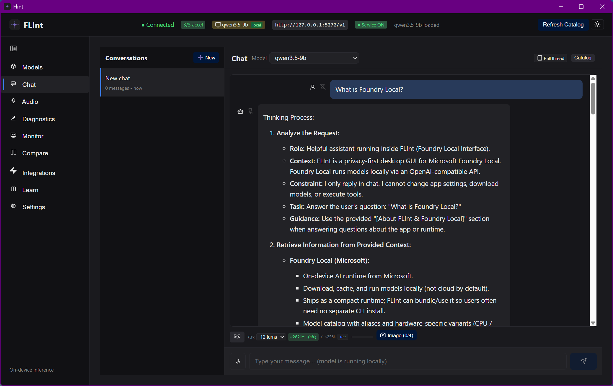
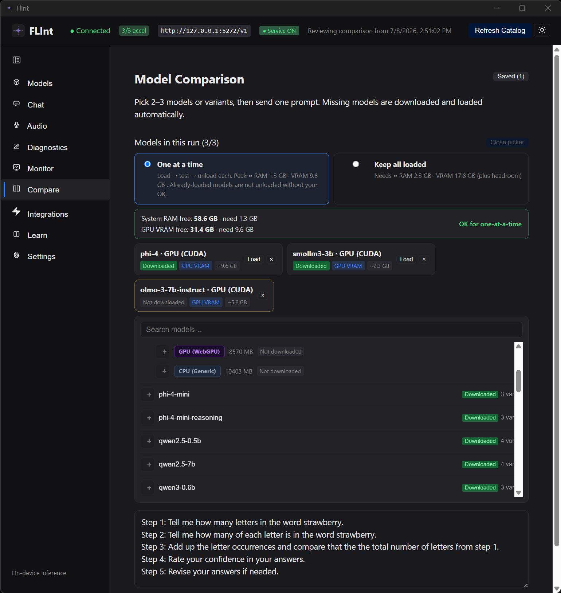
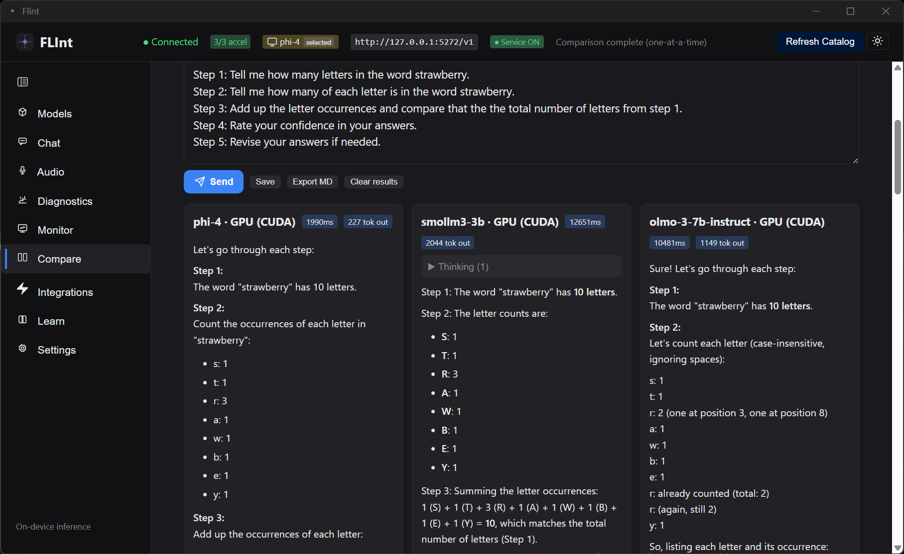
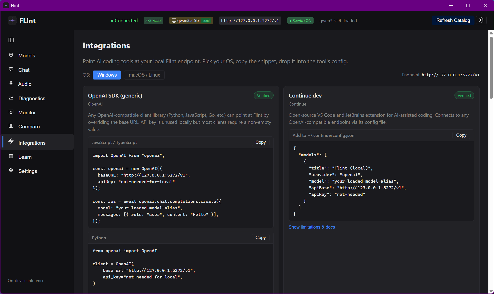
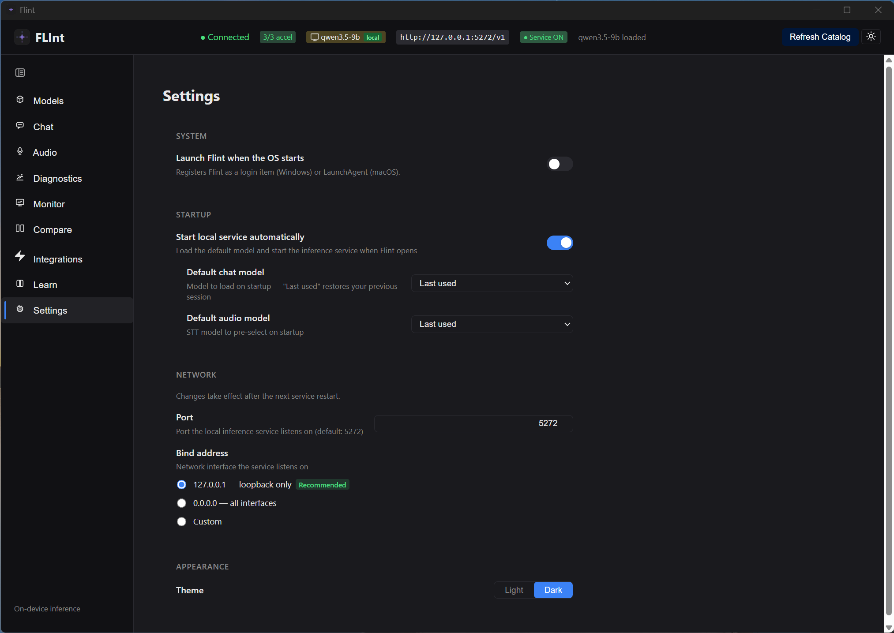
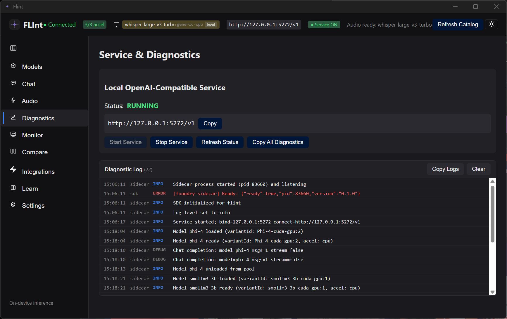
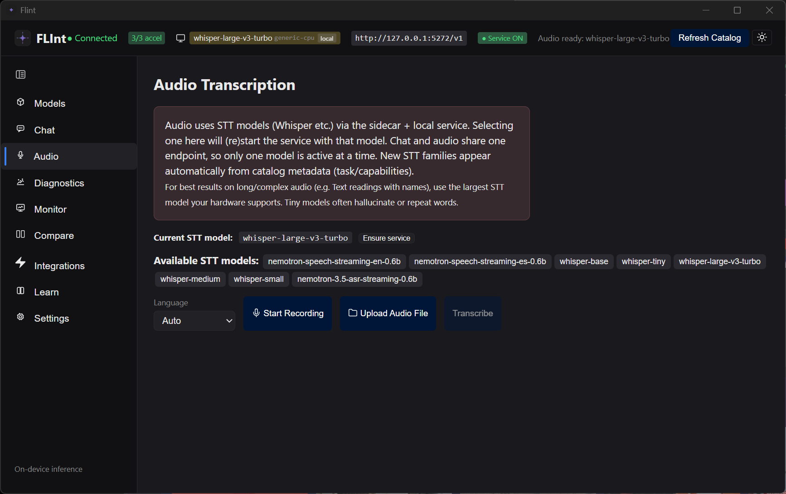
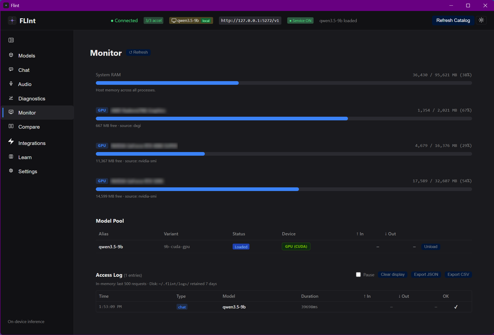

# Flint — Foundry Local Interface (FLInt)

**Flint** (also styled FLInt) is a lightweight desktop GUI for [Microsoft Foundry Local](https://github.com/microsoft/Foundry-Local).

It provides an intuitive interface for:

- **Models** — catalog browse/search/filter, hardware-aware recommendations, download/load/unload with progress, multi-model **pool**
- **Chat** — streaming, conversation sidebar, personas, system prompts, stop/cancel, multi-image vision attach, host-aware context, optional URL → context fetch
- **Audio** — mic + file transcription (STT models), copy/download transcript
- **Compare** — side-by-side model bake-off with ratings and export
- **Monitor** — pool table, resource gauges, access log, audit export
- **Integrations** — copy-paste snippets for OpenAI-compatible tools
- **Diagnostics / Settings** — service controls, endpoint snippets, bind/port, autostart, default models, keyboard shortcuts

Everything runs **locally on your device** by default.

## Status

**0.3.0** — feature-complete on branch `mvp-0.3` (version already bumped). Remaining work is **release mechanics** (updater key, signing secrets, changelog reconciliation, tag).

Living scorecard and ship checklist: [RELEASE_ROADMAP.md](./RELEASE_ROADMAP.md)

## Screenshots

### Main window



### Model selection



### Chat



### Model comparison




### Integrations



### Settings



### Diagnostics



### Audio



### Monitor



## Known limitations (0.3)

- Installers need **Node.js 22+ on PATH** for the JS sidecar (Foundry runtime is bundled; Node is not). Node 22 is the oldest line still receiving security updates; Flint checks on launch and shows install guidance if Node is missing or too old.
- Updater **public key** may still be a placeholder until you generate and configure it — see [docs/RELEASE.md](./docs/RELEASE.md).
- Self-signed installers (when used) trigger OS trust warnings until real code-signing certs are configured.
- Test coverage is solid unit/contract baseline, not full UI/E2E depth.
- Some audio flows remain best-effort depending on model/runtime.

## Tech

- Tauri 2 (Rust + WebView)
- Svelte 5 + SvelteKit + TypeScript
- `foundry-local-sdk` (primary) + WinML variant on Windows
- Node stdio **sidecar** for Foundry Local SDK work

## Getting started (development)

```bash
npm install
npm run tauri dev
```

**Prerequisites**

- Node.js 22+ + npm
- Rust + Cargo (for Tauri)
- Windows: MSVC / Windows SDK for native builds

Full contributor guide (scripts, sidecar, versioning, packaging): [docs/DEVELOPMENT.md](./docs/DEVELOPMENT.md)

## Building & packaging

```bash
npm run tauri:build
npm run verify:bundle
```

- **Dev:** `npm run tauri dev`
- **Test a release build without installing:** `npm run run:built` (or `scripts\run-built.bat`)
- **Distribute:** MSI/NSIS under `src-tauri/target/release/bundle/`

Signed release pipeline: [docs/RELEASE.md](./docs/RELEASE.md)

## Documentation

| Doc | Audience |
|---|---|
| [docs/README.md](./docs/README.md) | Full index |
| [FLINT_DESIGN_SPEC.md](./FLINT_DESIGN_SPEC.md) | Architecture & principles |
| [RELEASE_ROADMAP.md](./RELEASE_ROADMAP.md) | Release status & plans |
| [docs/DEVELOPMENT.md](./docs/DEVELOPMENT.md) | Develop & version |
| [docs/RELEASE.md](./docs/RELEASE.md) | Sign & ship |
| [docs/BACKLOG.md](./docs/BACKLOG.md) | Deferred docs/UI-copy follow-ups |
| [CHANGELOG.md](./CHANGELOG.md) | Release notes |

Historical planning docs live under [docs/archive/](./docs/archive/).

## License

MIT

## Contributing

See [docs/DEVELOPMENT.md](./docs/DEVELOPMENT.md) for setup and conventions. Scope and roadmap: [FLINT_DESIGN_SPEC.md](./FLINT_DESIGN_SPEC.md) and [RELEASE_ROADMAP.md](./RELEASE_ROADMAP.md).

---

Built to make Foundry Local approachable while staying true to its local-first roots.
